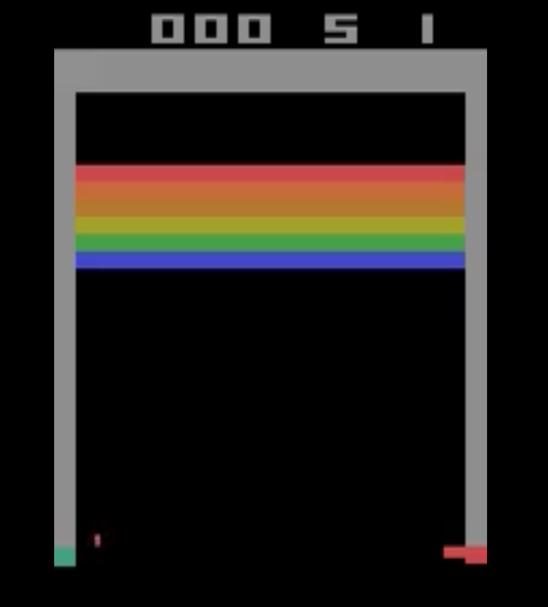
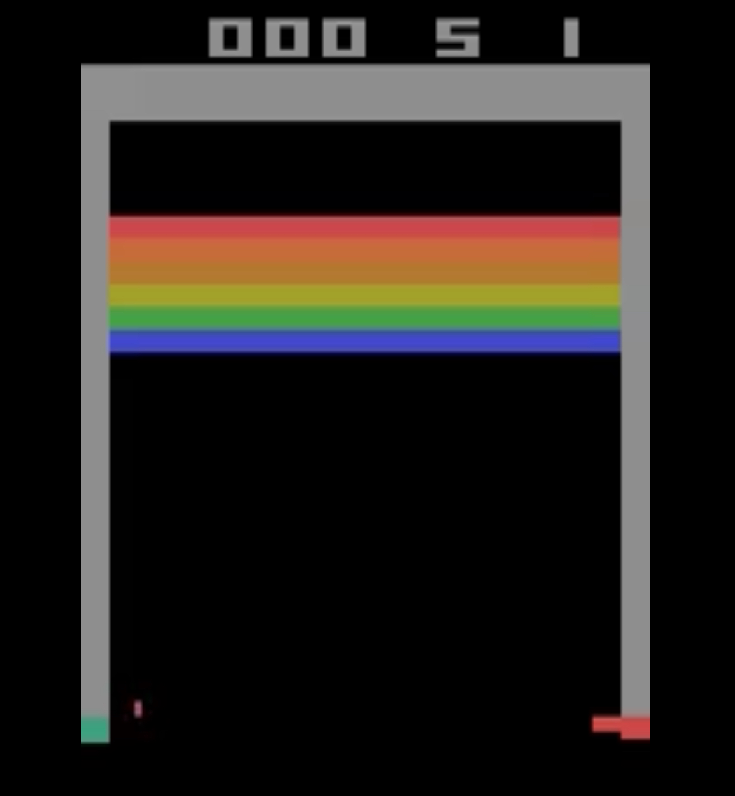

# DQN on Breakout — Early vs Later (short run)

Two short clips from adapting the Pong starter to **ALE/Breakout-v5**.

---

## DQN Breakout Agent Evaluation  

Watch how performance improves as training progresses:

| Episode | Model             | Preview                                      | Video |
|---------|-------------------|----------------------------------------------|-------|
| Early   | Near-random       |  | [▶ Watch](https://raw.githubusercontent.com/ramonadamec/CSCI-166/main/videos/early_breakout.webm) |
| Later   | Emerging strategy |  | [▶ Watch](https://raw.githubusercontent.com/ramonadamec/CSCI-166/main/videos/later_breakout.webm) |

---

## Notes
- Env: `ALE/Breakout-v5`
- Preprocessing: SB3 `AtariWrapper` (reward clip, `noop_max=30`) → ImageToPyTorch → Frame stack (4) → FIRE reset  
- Model: DQN (84×84 grayscale, 4 frames; conv → 512 → `n_actions=4`)
- Quick-run config: `replay_start=1k`, `ε-decay=10k`, target sync every `500` frames
- Recording: evaluation mode, ~12s per video at 15 fps with a slight slow-down for clarity
