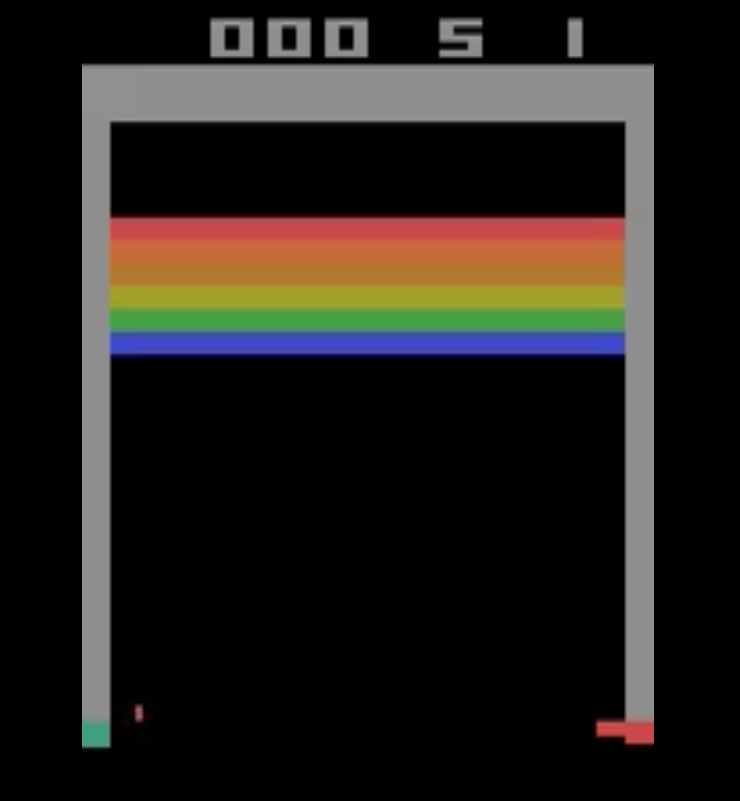

# DQN on Breakout — Early vs Later (short run)

Watch how performance improves as training progresses:

| Episode | Model            | Preview                               | Video                                |
|---------|------------------|---------------------------------------|--------------------------------------|
| Early   | Near-random      |  | <video src="../videos/early_breakout.webm" controls width="320"></video> |
| Later   | Emerging strategy |  | <video src="../videos/later_breakout.webm" controls width="320"></video> |

---

### Notes
- Env: `ALE/Breakout-v5`  
- Preprocessing: SB3 `AtariWrapper` (reward clip, `noop_max=30`) → ImageToPyTorch → Frame stack (4) → FIRE reset  
- Model: DQN (84×84 grayscale, 4 frames; conv → 512 → `n_actions=4`)  
- Quick-run config: `replay_start=1k`, `ε-decay=10k`, target sync every `500` frames  
- Recording: evaluation mode, ~12s per video at 15 fps with a slight slow-down for clarity  
